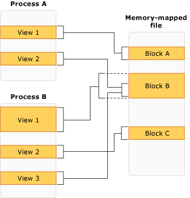

# 1- General Notes on Process Management in C#

Process management in C# involves creating, monitoring, and controlling external processes within a .NET application. The `System.Diagnostics` namespace provides tools to start processes, interact with them, and manage their lifecycle. Below are key concepts and best practices for handling processes effectively in C#.

## Key Concepts

### 1. **Starting a Process**
- Processes in C# can be started using `Process.Start()`, which initializes an external application or program.
- The `ProcessStartInfo` class allows configuring process properties like the executable path, command-line arguments, and whether to use the shell to execute the process.
- Common use cases include launching other applications, opening files with specific programs, or executing scripts.

### 2. **Monitoring Running Instances**
- Applications often need to track how many instances of a particular process are running, either for load management or for ensuring a minimum or maximum number of instances.
- `Process.GetProcessesByName()` can be used to retrieve a list of running processes by their name, enabling control over instance counts and allowing specific actions based on the result.

### 3. **Controlling Process Lifespan**
- Processes can be terminated, restarted, or allowed to run based on specific criteria.
- This approach is useful in scenarios where a service or application requires a constant number of instances for stability or availability.
- Setting limits on running instances can prevent resource exhaustion and ensure that only the necessary number of processes are active.

## Common Use Cases

- **Launching Browsers or External Applications**: Opening specific URLs or files using default applications.
- **Process Synchronization**: Ensuring a fixed number of process instances are running for applications that need redundancy.
- **Background Task Execution**: Running scripts or batch jobs in the background without user interaction.
- **Process Monitoring and Management**: Tracking process activity, resource usage, and managing lifecycle events like shutdown or restart.

# 2- Memory-Mapped Files

| Memory-mapped files provide a powerful way to work with files by mapping them directly to a region of virtual memory, allowing efficient read and write operations. This approach is especially beneficial for handling large files or data-intensive operations, as it avoids costly file I/O overhead. |  |
|----------------------------------------------------------------------------------------------------------------------------------------------------------------------------------------------------------------------------------------------------------------------------------------------------------|------------------------------------------------------------------------------------------------|

## Benefits of Memory-Mapped Files

- **Efficient Data Access**: Directly map a file to memory for faster, more efficient access compared to traditional
  file I/O.
- **Optimal for Large Files**: Ideal for scenarios like log file processing or working with large datasets that may not
  fit entirely in memory.
- **Low-Overhead Inter-Process Communication**: In Windows, memory-mapped files allow memory sharing between processes,
  offering a low-overhead alternative to methods like remoting and Windows Communication Foundation (WCF).
- **Fast Random Access**: Memory-mapped files enable rapid random access to data, significantly faster than file streams
  or pipes, which are optimized for sequential access.

## Usage in .NET

In earlier .NET versions, creating and accessing memory-mapped files required calling Windows API functions directly—a
complex and cumbersome process. The new `MemoryMappedFile` class in .NET wraps these native functions, providing a
simplified and intuitive interface.

## Additional Capabilities of Memory-Mapped Files

Memory-mapped files don’t necessarily need to be shared with other processes—they can also be used for fast random
access to a file, whether it’s an existing or newly created disk file. To create such a file, you can use
`MemoryMappedFile.CreateFromFile`, where the `map name` parameter can be set to `null` if the file is only intended for
single-process access.

### View Accessors and Data Types

View accessors, which provide read and write access to the memory-mapped file, can only handle *unmanaged types*.
Unmanaged types are simple value types—such as `int`, `bool`, `double`, `long`, `decimal`, and other structs without
reference type fields. Since strings are reference types, they need to be managed as byte arrays when working with
memory-mapped files.

### Efficient Handling of Large Files

Memory-mapped files also make it possible to work with very large files without loading the entire file into memory. By
creating a view of just a portion of the file, rather than mapping the entire file, you can efficiently manage memory
usage while accessing the data you need.

## Advantages in Cross-Process Communication

Memory-mapped files are particularly useful when multiple processes need to share data on the same machine. This method
is less resource-intensive than other inter-process communication options, making it a preferred choice for
high-performance applications.

---

### Learn More

To dive deeper into memory-mapped files and their applications, refer to the
official [.NET Documentation](https://docs.microsoft.com/en-us/dotnet/api/system.io.memorymappedfiles.memorymappedfile)
or explore examples of complex usage scenarios.
